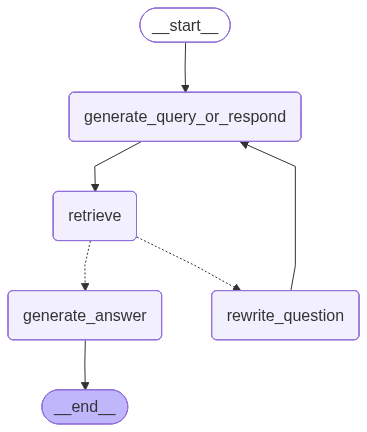

# Tax Intelligence & Compliance Assistant

A RAG-based question-answering system for Sri Lanka IRD (Inland Revenue Department) tax documents.

---

## Table of Contents

- [Tech Stack](#tech-stack)
- [Setup](#setup)
  - [Prerequisites](#prerequisites)
  - [Backend Setup](#backend-setup)
  - [Frontend Setup](#frontend-setup)
- [Running the Application](#running-the-application)
- [Pages](#pages)
  - [Chat Page (Users)](#chat-page-users)
  - [Admin Page (Document Upload)](#admin-page-document-upload)
- [API Documentation](#api-documentation)
- [Architecture](#architecture)
- [Special Handling](#special-handling)
- [Assumptions](#assumptions)
- [Project Structure](#project-structure)

---

## Tech Stack

### Backend

| Technology                   | Purpose                |
| ---------------------------- | ---------------------- |
| FastAPI                      | REST API framework     |
| Google Gemini 2.5 Flash Lite | LLM for generation     |
| Google Gemini Embedding      | Text embeddings        |
| ChromaDB                     | Vector store           |
| LangGraph                    | Workflow orchestration |
| PyMuPDF                      | PDF processing         |

### Frontend

| Technology     | Purpose                   |
| -------------- | ------------------------- |
| Next.js 15     | React framework           |
| TypeScript     | Type safety               |
| Tailwind CSS   | Styling                   |
| React Markdown | Render markdown responses |

---

## Setup

### Prerequisites

- Python 3.12+
- Node.js 18+
- [uv](https://docs.astral.sh/uv/) (Python package manager)
- Google AI API key

### Backend Setup

```bash
cd server
uv sync
```

Create a `.env` file in the `server` folder:

```env
GOOGLE_API_KEY=your_google_api_key
```

### Frontend Setup

```bash
cd front-end
npm install
```

---

## Running the Application

### 1. Start Backend Server

```bash
cd server
uv run fastapi dev
```

Backend runs at: **http://localhost:8000**

### 2. Start Frontend Server

```bash
cd front-end
npm run dev
```

Frontend runs at: **http://localhost:3000**

---

## Pages

### Chat Page (Users)

**URL:** http://localhost:3000

The main chat interface where users can ask questions about tax documents.

**Features:**

- Real-time chat with the AI assistant
- Markdown-formatted responses
- Citation links to source documents
- Session-based conversation history

**How to use:**

1. Open http://localhost:3000 in your browser
2. Type your tax-related question in the input box
3. Press Enter or click Send
4. View the AI response with source citations

---

### Admin Page (Document Upload)

**URL:** http://localhost:3000/admin

Admin interface for uploading and ingesting PDF documents into the knowledge base.

**Features:**

- Upload multiple PDF files
- Specify source URLs for each document
- Progress feedback during upload
- Success/error messages

**How to use:**

1. Open http://localhost:3000/admin in your browser
2. Click "Choose Files" and select PDF documents
3. Enter the source URL for each document (optional but recommended)
4. Click "Upload" to ingest documents into the system

---

## API Documentation

### 1. Health Check

```
GET /
```

**Response:**

```json
{ "message": "Hello World" }
```

---

### 2. Upload Documents

```
POST /upload
```

Upload PDF documents to the knowledge base.

**Request:** `multipart/form-data`

- `files`: PDF files (multiple)
- `urls`: Source URLs for each file

**Example (PowerShell):**

```powershell
$form = @{
    files = Get-Item -Path "tax_guide.pdf"
    urls = "https://ird.gov.lk/tax_guide.pdf"
}
Invoke-RestMethod -Uri "http://localhost:8000/upload" -Method Post -Form $form
```

**Response:**

```json
{
  "message": "Successfully ingested 45 document splits from 1 files.",
  "files_processed": 1
}
```

---

### 3. Chat

```
POST /chat
```

Ask questions about tax documents.

**Request Body:**

```json
{
  "message": "What is the corporate tax rate?",
  "thread_id": "user123"
}
```

**Example (PowerShell):**

```powershell
Invoke-RestMethod -Uri "http://localhost:8000/chat" `
    -Method Post `
    -Headers @{"Content-Type"="application/json"} `
    -Body '{"message": "What is the corporate tax rate?", "thread_id": "test1"}'
```

**Response:**

```json
{
  "response": "The standard corporate tax rate is 30%...\n\n**Sources:**\n[1]- [Corporate Tax Guide](https://ird.gov.lk/...) - Page 5 - 12.2 Tax Rates"
}
```

---

## Architecture



### Flow Diagram

```
┌─────────────────────────────────────────────────────────────────┐
│                         User Query                              │
└─────────────────────────────────────────────────────────────────┘
                                │
                                ▼
┌─────────────────────────────────────────────────────────────────┐
│                  generate_query_or_respond                      │
│         (Decide: retrieve documents OR respond directly)        │
└─────────────────────────────────────────────────────────────────┘
                                │
              ┌─────────────────┴─────────────────┐
              │                                   │
              ▼                                   ▼
┌──────────────────────┐              ┌───────────────────────────┐
│    Direct Response   │              │    retrieve (ToolNode)    │
│        (END)         │              │   - Query expansion       │
└──────────────────────┘              │   - Vector search         │
                                      └───────────────────────────┘
                                                  │
                                                  ▼
                                      ┌───────────────────────────┐
                                      │      grade_documents      │
                                      │   (Relevant? yes/no)      │
                                      └───────────────────────────┘
                                                  │
                                ┌─────────────────┴─────────────────┐
                                │                                   │
                                ▼                                   ▼
                    ┌───────────────────┐             ┌─────────────────────┐
                    │  generate_answer  │             │  rewrite_question   │
                    │  (Structured RAG) │             │  (Improve query)    │
                    └───────────────────┘             └─────────────────────┘
                                │                                   │
                                ▼                                   │
                    ┌───────────────────┐                           │
                    │       END         │◄──────────────────────────┘
                    └───────────────────┘         (retry with new query)
```

### Node Descriptions

| Node                        | Description                                                  |
| --------------------------- | ------------------------------------------------------------ |
| `generate_query_or_respond` | Decides whether to search documents or respond directly      |
| `retrieve`                  | Searches ChromaDB with query expansion for tax acronyms      |
| `grade_documents`           | Checks if retrieved documents are relevant to the question   |
| `generate_answer`           | Creates structured response with citations                   |
| `rewrite_question`          | Improves the query and retries if documents are not relevant |

---

## Special Handling

### Tax Acronym Expansion

The system automatically expands uppercase tax acronyms for better retrieval:

| Acronym | Full Form                          |
| ------- | ---------------------------------- |
| SET     | Statement of Estimated Tax Payable |
| VAT     | Value Added Tax                    |
| PAYE    | Pay As You Earn                    |
| WHT     | Withholding Tax                    |
| APIT    | Advanced Personal Income Tax       |
| ESC     | Economic Service Charge            |
| NBT     | Nation Building Tax                |
| SVAT    | Simplified Value Added Tax         |
| TIN     | Tax Identification Number          |
| CIT     | Corporate Income Tax               |
| IRD     | Inland Revenue Department          |

**Why?**  
Without expansion, "SET" might match the common word "set" (e.g., "a set of instructions"), returning irrelevant results.

**Example:**  
Query: `"SET exemptions"` → Expanded: `"Statement of Estimated Tax Payable (SET) exemptions"`

### Query Rewriting

When retrieved documents are not relevant, the system:

1. Rewrites the question with expanded acronyms
2. Retries the search
3. If still unclear, asks the user for clarification (without polite phrases like "Thank you")

### Structured Responses

Answers include:

- Markdown-formatted content
- Inline citations `[1]`, `[2]`
- Source list with document name, URL, page number, and section
- Disclaimer about professional tax advice

---

## Assumptions

1. **Document Format**: All uploaded documents are PDFs from Sri Lanka IRD
2. **Language**: Documents and queries are in English
3. **Acronyms**: Tax acronyms follow Sri Lanka IRD conventions
4. **No Legal Advice**: System provides information only, not professional tax advice
5. **Session Persistence**: Chat history is stored in-memory (lost on server restart)
6. **Single User**: Frontend does not have authentication (for demo purposes)

---

## Project Structure

```
tax_intelligence_and_complience_assistant/
│
├── README.md                 # This file
│
├── server/                   # Backend (FastAPI + LangGraph)
│   ├── main.py              # API endpoints
│   ├── graph.py             # LangGraph workflow
│   ├── graph.png            # Workflow visualization
│   ├── nodes.py             # Graph nodes (generate, grade, rewrite)
│   ├── tools.py             # Retriever tool with query expansion
│   ├── services.py          # Document ingestion & upload services
│   ├── factories.py         # Factory classes
│   ├── interfaces.py        # Abstract interfaces
│   ├── utils.py             # Utility functions
│   ├── chroma_db/           # Vector store persistence
│   └── pyproject.toml       # Python dependencies
│
└── front-end/               # Frontend (Next.js)
    ├── src/
    │   └── app/
    │       ├── page.tsx     # Chat page (users)
    │       ├── admin/
    │       │   └── page.tsx # Admin page (document upload)
    │       ├── layout.tsx   # Root layout
    │       └── globals.css  # Global styles
    ├── package.json         # Node dependencies
    └── tailwind.config.ts   # Tailwind configuration
```
